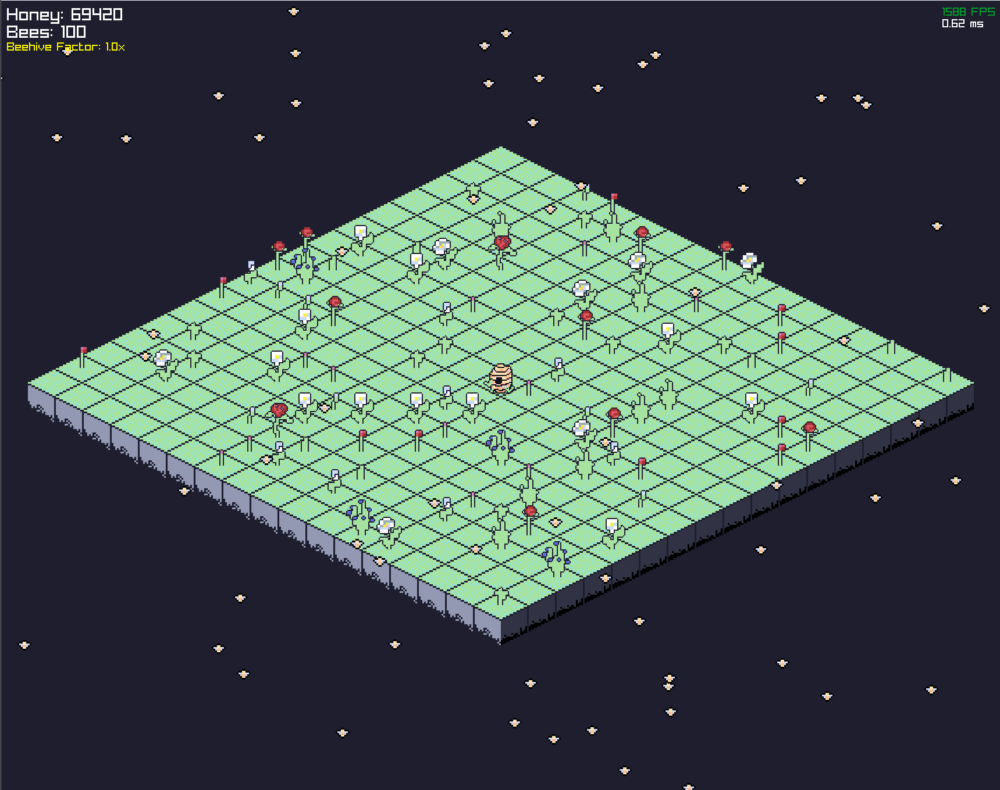

# Buzzness Tycoon

Buzzness Tycoon is a simple game that I'm working on to learn Zig and have an excuse to use raylib.

## Concept

A chill, cozy idle game. On an isometric floating meadow, bees drift between flowers gathering pollen and carrying it back to the hive to make honey. Spend honey in the shop and upgrade tree to unlock faster bees, bigger grids, labs, and prestige — then sit back and watch the little world hum along.

## Ambience & feel

The meadow is meant to be relaxing to leave running:

- **Day/night cycle** — a slow (~5 min) dawn → day → dusk → night loop with a gradient sky, drifting clouds, a rising/setting sun, a soft moon and a twinkling star field. The whole scene is lit by the current time of day.
- **A living world** — bees bob and buzz with soft shadows, flowers sway in the breeze and cast shadows, the hive gently breathes, and pollen-laden bees glow.
- **Fireflies** — daytime pollen dust warms into glowing fireflies at night.
- **Procedural audio** — a gentle synthesized music-box loop plus soft pentatonic chimes when honey is delivered. No sample assets; it's all generated at startup.

## Controls

- **Mouse** — drag to pan, scroll to zoom, click tiles/flowers/bubbles to interact, use the side panel to buy.
- **B / M** — activate Burst / Bloom labs (once unlocked).
- **N** — mute / unmute audio.
- **Esc** — close popups / open the pause menu.
- **Alt+Enter** — toggle fullscreen.

Dev/debug env vars: `BT_WINDOWED=1` launches in a window instead of fullscreen; `BT_AUTOPLAY=1` skips the title screen; `BT_PHASE=0..1` freezes the time of day; `BT_SHOOT=N` renders N frames, writes `bt_shot.png`, then exits.

## Screenshot



## Build

Requires **Zig 0.16** (uses `raylib-zig` 6.0.0).

You can use debug for vscode if you have the C/C++ extension. 

Or if you have Zig installed:

```shell
zig build run # this will build and run the project
```

Or: 

```shell
zig build 
./zig-out/bin/buzzness-tycoon.exe # or only buzzness-tycoon if in unix
```